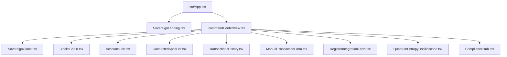

# 📂 Cryptographic Component Directory (`/src/components`)

This directory houses the primary frontend UI interactive segments, data visualizations, operational verification systems, and cryptographic simulators of the **SOVR Core Command Center** interface hierarchy. All items are modular, typed with standard TypeScript, and fully styled via Tailwind CSS utility classes with custom standard `motion` spring states for seamless visual transitions.

---

## 🏗️ Core Structural Layout

The dashboard is structured hierarchy-wise to maintain high performance and clean data flow across distinct subsystems:



---

## 🧩 Architectural Breakdown & Attribute API Specs

### 1. `SovereignLanding.tsx`
* **Purpose**: Implements the high-security portal splash gatekeeper. It locks navigation until the operator certifies their cryptographic authority, generating biometric/session verification sounds using the browser Web Audio API. Also displays ZKP (Zero-Knowledge Proof) agreements and immutable compliance documents.
* **Property Signature & Interface**:
  ```typescript
  interface SOVRLandingProps {
    onEnter: () => void;            // Triggered upon successful authorization certificate matching
    totalAssetsUSD: number;         // Root reference value representing active aggregated balances
    totalSVT: number;               // Consolidated state tracker for circulating SVT supply units
  }
  ```
* **Critical Subsections**:
  - `AudioSynthService`: Standard inline oscillator module synthesizing high cyber chimes (880Hz to 1400Hz saw sweep) and active sub-bass drops (90Hz drop down to 32Hz triangle waveforms). Runs fully client-side on consumer interaction.
  - Interactive canvas vector particle grid with glitching matrices representing raw byte stream entries.

---

### 2. `CommandCenterView.tsx`
* **Purpose**: Serves as the primary operational viewport for administrative commands. Houses active monitoring tiles, telemetry feeds, and houses child controls for registering assets or verifying Webhook endpoints.
* **Component Attributes / State Hierarchy**:
  - Receives complete state matrices from `App.tsx` (all ledger histories, total seed states, active webhook configs) to broadcast state events instantly.
  - Features real-time state clocks synchronizing local timezone offsets with standard UTC offsets.
  - Allows the operator to toggle between different modules: **Network Telemetry**, **Treasury Pool**, **Quorum Consensus**, **Ingestion Portal**, **Autonomous Agents**, **Forensics Ledger**, and **SOVR Compliance**.

---

### 3. `SovereignGlobe.tsx`
* **Purpose**: Multi-layer 3D network visualization rendered using Three.js / CSS screen space projections. Draws geographic trust markers, rotating orbit trajectories, and transaction pulse waves.
* **Property Signature & Interface**:
  ```typescript
  interface SOVRGlobeProps {
    geoNodes: GeoNode[];             // Structured coordinates mapping active regional financial anchors
    routes: Route[];                 // Global route path matrices defining cryptographic peering channels
    selectedNodeId: string | null;   // Active node highlight filter state
    onSelectNode: (id: string | null) => void;
    onSelectRoute: (id: string | null) => void;
    heatmapOn: boolean;              // Global toggle rendering local density coordinates
  }
  ```
* **Performance Parameters**:
  - Utilizes `requestAnimationFrame` for rotation math, bounded with component cleanup loops inside dedicated `useEffect` hooks to prevent memory leaks and frame jitter.

---

### 4. `QuantumEntropyOscilloscope.tsx`
* **Purpose**: Simulates quantum entropic coherence levels on an interactive HTML5 viewport. Mimics continuous hardware entropy accumulation used to generate cryptographically safe challenge-response hashes.
* **Features**:
  - **Superposition Collapse**: Clicking triggers manual wave-function collapsing, falling instantly into deterministic state vectors (`|0⟩` or `|1⟩`) with realistic dampening mathematics inside a 60Hz loop.

---

### 5. `AccountsList.tsx`
* **Purpose**: Modern double-entry account ledger tracker, showing category filters for:
  - Assets (`asset`)
  - Escrow (`escrow`)
  - Liabilities (`liability`)
  - Revenues (`revenue`)
  - Capital/Equities (`equity`)
* **Property Signature**:
  ```typescript
  interface AccountsListProps {
    accounts: LedgerAccount[];       // Structured double-entry ledger state
  }
  ```

---

### 6. `BlocksChain.tsx`
* **Purpose**: Fully browsable vertical and horizontal timeline displaying successive block heights sealed via consensus quorum. Detail panels expose raw block hashes, timestamps, and mathematical parent signatures.
* **Property Signature**:
  ```typescript
  interface BlocksChainProps {
    chain: HashBlock[];              // Immutable chronologically ordered blockchain nodes
    onForceSeal: () => void;         // Triggers instant block mining utilizing local transaction queues
    isSealing: boolean;              // Visual loading toggle signaling active hash search
  }
  ```

---

### 7. `ConnectedAppsList.tsx`
* **Purpose**: Exposes structural attributes of live financial gates, bridge connections, and automated audit logs. Displays continuous ping simulations and security clearance metrics.
* **Dynamic Items**:
  - Renders live system heartbeats with mutual TLS (`mTLS`) validation credentials.

---

### 8. `TransactionsHistory.tsx`
* **Purpose**: Robust transactional grid with deep sorting capabilities. Shows forensic routing trees mapping credit sources and debit destinations.
* **Features**:
  - Supports search pattern filtering against specific public transaction hash addresses or transaction descriptions.

---

### 9. `ManualTransactionForm.tsx` & `RegisterIntegrationForm.tsx`
* **Purpose**: Data-entry forms verifying and executing ledger changes:
  - **Manual Transactions**: Requires debit balance offsets to strictly match credit values (`Debit == Credit` alignment) before firing off the state dispatch callbacks in App.tsx. Implements inline mathematical verification tools.
  - **Register Integration**: Supports entering remote API targets, token challenges, and signature credentials securely.

---

### 10. `ComplianceHub.tsx` (SOVR Development Holdings LLC Compliance Center) [NEWLY EXPANDED]
* **Purpose**: A comprehensive, specialized regulatory command board modeled after SOVR Development Holdings LLC statutory enterprise guidelines. It bridges robust multi-segment validation criteria with ultra-modern high-density ledger state visualization tools.
* **Property Signature & Interface**:
  ```typescript
  interface ComplianceHubProps {
    accounts: LedgerAccount[];       // Live double-entry GAAP ledger configuration
    transactions: Transaction[];     // Global recorded transaction ledgers
    formatCurrency: (amountMinor: number, currency: string) => string; // Core scaling math
  }
  ```
* **Integrated Submodules**:
  - **Playbook Workspace**: 
    - *F0901 Account Master Formatter*: Parses raw account input strings dynamically utilizing a period-point (`.`) separator to compute standard (`BU.OBJ.SUB`), 3rd G/L alternate, short ID keys, and speed codes.
    - *F0901 Master Index Reorder Sweep*: Emulates critical legacy restructuring runs with interactive real-time text output logs indicating index integrity validation.
    - *Enhanced Subledger Analysis (ESA)*: Supports filtering ledger balances by legacy subledger parameters (Asset 'A', Numeric 'N', Customer 'C') and maps references against standard master files (`F0101 Address Book` and `F1201 Asset Master`).
  - **Pre-Audit Proofing Console (P09301)**: 
    - Compiles transactional registers into raw matrix prints representing:
      - *Unposted General Journals* (Proof registers for open postings)
      - *Batch Sequences (F0011)* (Continuous record batching verification)
      - *Categorized Account Numbers* (Sequenced classification listings)
    - Automatically calculates absolute raw checksum hash ranges by omitting decimal representation flags.
  - **Trial Balance Audits (P09410 Series)**:
    - Renders dynamic trial balances from live `F0902` summaries.
    - Features rapid toggles between *Business Unit Sequence (P09410)* and *Object Account Sequence (P094121)*, summarizing net debits vs net credits alongside strict balanced alignment tags.
  - **Statutory Corporate Statements (P10111)**:
    - *Accrual Income Statement (P10211)*: Standard GAAP calculations outlining active Operating Revenue, Product Cost of Goods Sold (COGS), Gross Operating Margins, administrative Operational Expenses (OpEx), and Net Regulatory Income.
    - *Statement of Cash Flow (P10521 Compiled Check)*: Interactive checklist verifying F0008 fiscal dates, F0901 cash account mapping tags, GLG Automatic Accounting Instructions (AAI), and month-end accrual journal sweeps.
  - **Ledger Stress Integrity Scanner (F0911)**:
    - Initiates real-time verification scans cross-checking raw journal detail logs (`F0911`) against summarizing rows (`F0902`).
    - Outputs diagnostic exception report indices to detect and intercept ledger drift or balancing abnormalities.
    - Enforces *Ampersand Audit Policy* (&) overrides allowing operators to simulate standard bypass rules for temporary work-in-progress lines.
  - **Operations Print Desk & Document Export Bureau**:
    - Generates retro, high-density matrix plain text reports inside a styled vintage paper layout. 
    - Supports **Print Hardcopy** (utilizing a hidden iframe printing pipeline to generate margins-perfect physical prints without visual screen waste), **Download TXT File** (installs local physical ledger diagnostic logs), and **Copy Plain Text** triggers.

---

## 🔑 State & Data Binding Design Best Practices

1. **Avoid Double-State Synchronization**: Let the top parent (`App.tsx` or `CommandCenterView.tsx`) hold the absolute truth (single source of truth).
2. **Proper Cleanup**: Always release Web Audio context nodes and stop `setInterval` variables inside native React `useEffect` callback arrays to maintain zero memory leakage and prevent audio buffer glitches.
3. **Double-Entry Balance Verification**: Always assert that the sum of debit minor increments equals the sum of credit minor increments before performing state transition pushes.
